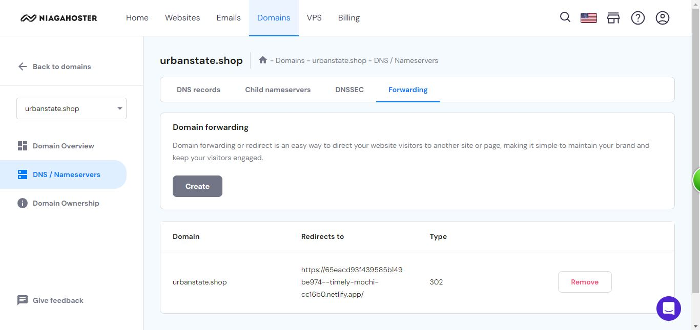

# About This Website
This website is created as a milestone project about company profile. This is a simple company profile

# Techstack used
    * HTML5
    * CSS
    * Javascript
    * Github

# Documentation
Here are the documentation of the deployment shown below
Log in to Netlify

Due to some circumstance, I have to deploy it manually

Since we use existing domain, I moved the domain from one to another

Change the domain forwarding in Niagahoster

Change the nameserver in Niagahoster from Netlify, wait for 24 hours for change

# About this Website
This website is a simple website about a company profile. The company I made is based on MAP and Kanmo which are two famous retail rights holder in Indonesia, Astra due to its distribution of heavy machineries, and Indomobil Group which is part of Salim Group. The website is a simple website about the company short profile and achievements along with the brands that are being brought under my company's umbrella. I also added a career section in the page to look more corporate like along with sliding banner. 
The header, sliding banner change automatically every 5 seconds made possible by using minor javascript

This is the about us section, I made it based on one foreign bank website

Career section

Some glipse of brand section, the logo will zoom every time you hover it

Simple footer

# Link
Netlify link: [https://65eacd93f439585b149be974--timely-mochi-cc16b0.netlify.app/](https://65eacd93f439585b149be974--timely-mochi-cc16b0.netlify.app/)
Custom domain: [urbanstate.shop](urbanstate.shop)